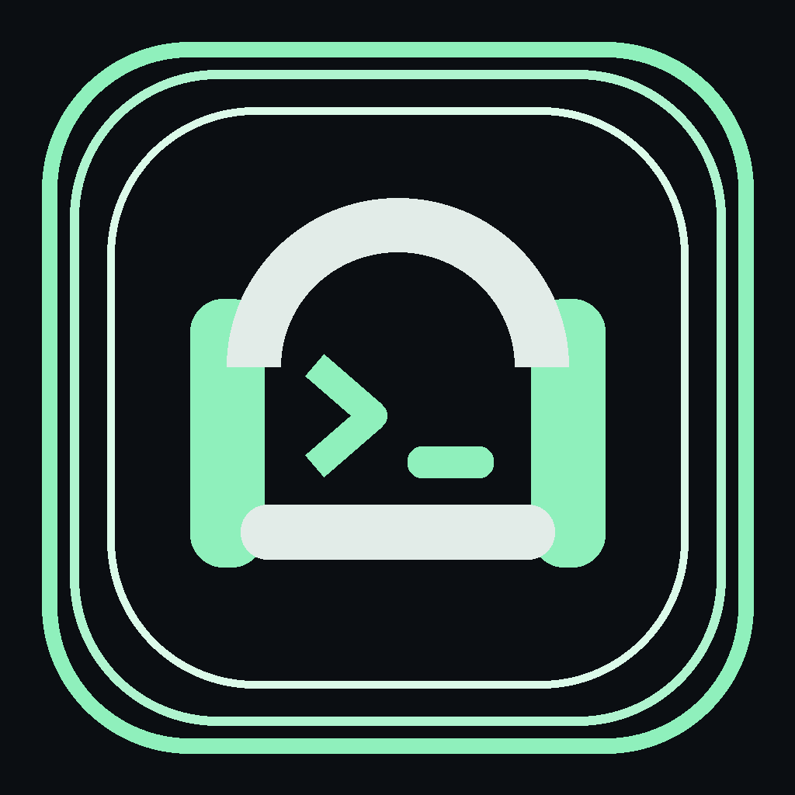
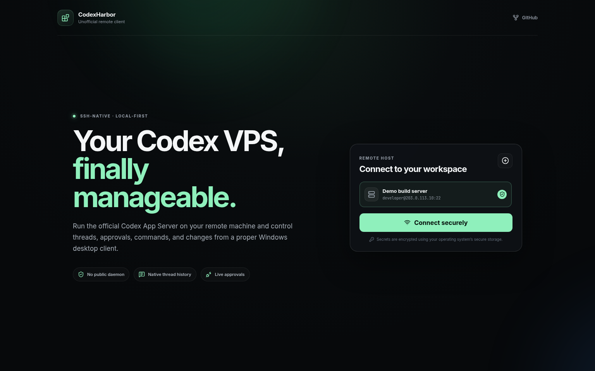
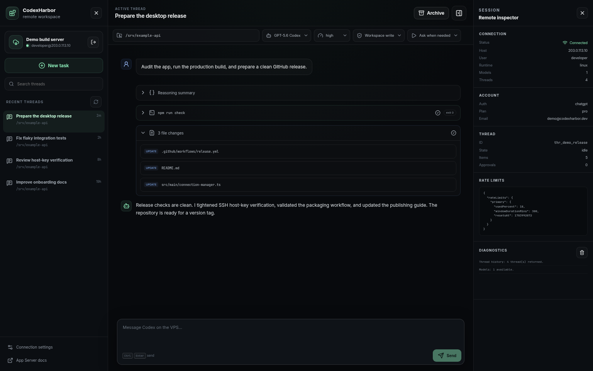
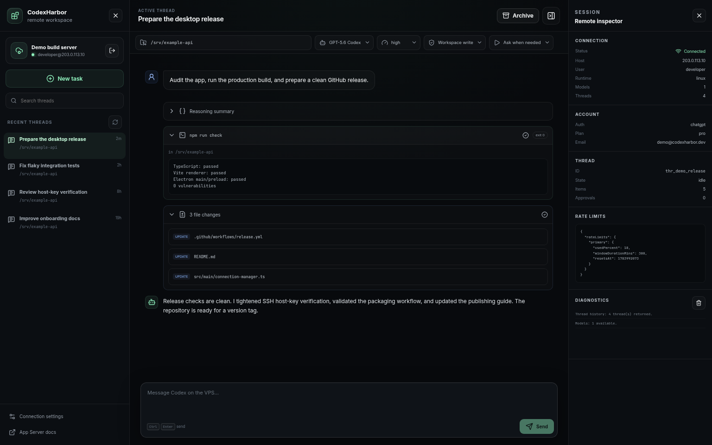
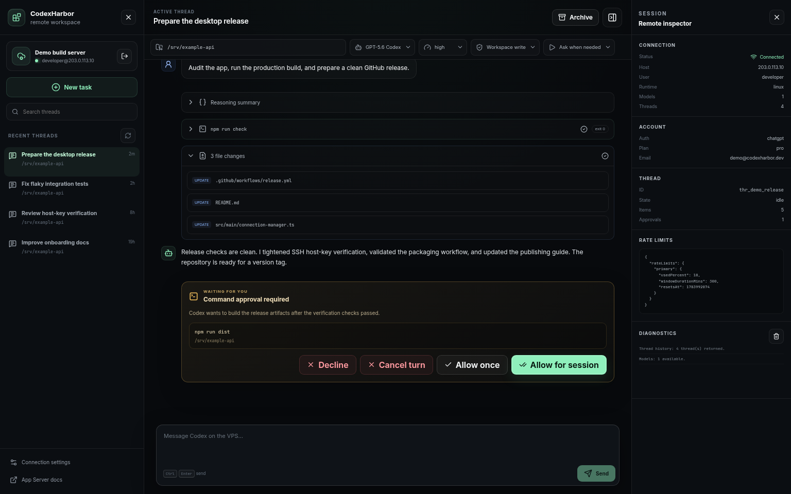

<div align="center">
  
  <h1>CodexHarbor</h1>
  <p><strong>A native desktop workspace for running OpenAI Codex on a remote VPS over SSH.</strong></p>
  <p>
    <a href="https://github.com/adondada/codexharbor/actions/workflows/build.yml"></a>
    <a href="LICENSE"></a>
    
  </p>
  <p><a href="https://www.producthunt.com/products/codexharbor?embed=true&amp;utm_source=badge-featured&amp;utm_medium=badge&amp;utm_campaign=badge-codexharbor" target="_blank" rel="noopener noreferrer"></a></p>
  <p>Download the latest Windows installer, portable EXE, AppImage or Debian package from GitHub
Releases.</p>
<p>Latest release: https://github.com/adondada/codexharbor/releases/latest</p>
</div>

CodexHarbor connects to a Linux VPS with SSH, starts `codex app-server --listen stdio://` inside that encrypted channel, and renders the official Codex App Server protocol as a polished desktop client.

No public daemon. No relay service. No browser terminal pretending to be a product.

> [!IMPORTANT]
> CodexHarbor is an unofficial community project. It is not affiliated with, endorsed by, or supported by OpenAI.

## Screenshots

### Connect securely to a remote Codex workspace



### Manage remote threads from one desktop workspace



### Inspect commands and file changes



### Review actions before Codex proceeds



## Why this exists

OpenAI now provides remote-project support over SSH in its official desktop experience. CodexHarbor is the transparent, direct alternative for people who want an MIT-licensed client, explicit SSH profiles, portable Windows builds, and no ChatGPT device relay. It does not pretend to reproduce every official feature.

## What already works

- SSH profiles using a private key, SSH agent, or password
- First-connect SSH host-key verification with optional SHA-256 pinning
- OS-backed encryption for saved passwords and key passphrases
- Real Codex threads: list, search, open, resume, create, interrupt, and archive
- Streaming assistant messages, plans, reasoning summaries, commands, command output, file changes, MCP calls, web-search items, and errors
- Mid-turn steering and interruption
- Command, file-change, permissions, user-input, and MCP elicitation approval cards
- Model, reasoning-effort, approval-policy, and sandbox controls
- ChatGPT device-code sign-in when the remote Codex CLI needs authentication
- Account state, rate-limit state, connection diagnostics, and reconnect handling
- Windows installer and portable `.exe` builds through GitHub Actions
- Linux AppImage and `.deb` builds through GitHub Actions

## Architecture

```text
Windows / Linux PC
┌────────────────────────────────────────────┐
│ CodexHarbor                                │
│ Electron renderer (React)                  │
│        │ restricted IPC                    │
│ Electron main process                      │
│        │ SSH                               │
└────────┼───────────────────────────────────┘
         │ encrypted SSH channel
         ▼
Linux VPS
┌────────────────────────────────────────────┐
│ bash -lc                                   │
│   codex app-server --listen stdio://       │
│        │ newline-delimited JSON-RPC        │
│        ▼                                   │
│ Your project and Codex configuration       │
└────────────────────────────────────────────┘
```

The App Server stays bound to standard input/output inside SSH. Do not replace that with a public WebSocket listener unless you enjoy explaining compromised infrastructure.

## Prerequisites

### On the VPS

1. A Linux account reachable through SSH.
2. A recent Node.js installation if your Codex installation requires it.
3. The Codex CLI installed and available on the login shell's `PATH`:

   ```bash
   codex --version
   codex app-server --help
   ```

4. Your project checked out on the VPS.
5. Either:
   - Codex already authenticated on the VPS, or
   - permission to complete device-code login from CodexHarbor.

A typical installation is:

```bash
npm install -g @openai/codex
codex login
```

For an existing installation, update Codex before reporting protocol bugs:

```bash
npm install -g @openai/codex@latest
```

### On your PC

- Windows 10/11 for the `.exe`, or a recent Linux desktop
- Git, Node.js 24, and npm 10 or newer only when building from source

## Fastest route to a Windows `.exe`

You do not need a Windows build machine. GitHub can perform the ritual sacrifice for you.

1. Create an empty public repository named `codexharbor` on GitHub.
2. Run `npm run configure:owner -- your-github-username` once.
3. Push the source using the commands in [Publishing to GitHub](#publishing-to-github).
4. Open the repository's **Actions** tab.
5. Open **Build desktop apps**, then choose **Run workflow**.
6. When it finishes, download the `CodexHarbor-Windows-x64` artifact.
7. It contains:
   - `CodexHarbor-Setup-<version>-x64.exe`
   - `CodexHarbor-Portable-<version>-x64.exe`

The installer is unsigned in the first release, so Windows SmartScreen may warn users. Code-signing certificates cost money because apparently trust requires an invoice.

## Run locally for development

```bash
git clone https://github.com/adondada/codexharbor.git
cd codexharbor
npm ci
npm run dev
```

Preview the interface without a VPS:

```bash
npm run demo
```

Production build:

```bash
npm run build
```

Windows packages, when run on Windows:

```powershell
npm run dist:win
```

Linux packages:

```bash
npm run dist:linux
```

Build output lands in `release/`.

## First connection

1. Start CodexHarbor.
2. Select **Add host**.
3. Enter:
   - a display name,
   - VPS hostname or IP,
   - SSH port, usually `22`,
   - SSH username,
   - authentication method,
   - an absolute default project directory such as `/srv/invisib`.
4. Add the host's SHA-256 fingerprint when you already know it.
5. Connect. If the fingerprint is blank, verify the first-connect fingerprint against your VPS provider, then choose **Trust and save**.
6. Select a model and policy, then create or open a thread.

### Obtain the server fingerprint

Run this on the VPS console or through an already trusted SSH connection:

```bash
ssh-keygen -lf /etc/ssh/ssh_host_ed25519_key.pub -E sha256
```

Copy the `SHA256:...` value into the host profile. You can also leave it blank and compare the first-connect prompt with this trusted value before saving it. Do not “verify” a fingerprint by copying it from the same untrusted connection, because that is security theatre with extra clicking.

### Recommended network setup

SSH directly over a trusted network is sufficient. For a VPS that should not expose SSH publicly, use Tailscale or WireGuard and enter the private mesh address in CodexHarbor.

## Remote shell behavior

CodexHarbor launches the remote command through:

```bash
bash -lc 'exec codex app-server --listen stdio://'
```

Using a login shell makes user-level Node version managers and shell `PATH` configuration more likely to work. If `codex` is still not found, make it available non-interactively:

```bash
command -v codex
```

Then either repair the login shell's `PATH`, or create a stable symlink, for example:

```bash
sudo ln -s "$(command -v codex)" /usr/local/bin/codex
```

Do not blindly run that command if `/usr/local/bin/codex` already exists.


## Troubleshooting: connected but empty

A green SSH status only proves the encrypted channel and App Server handshake succeeded. It does not prove thread history, model discovery, account state, or the project path loaded correctly. Version 0.1.1 reports each bootstrap stage separately instead of quietly presenting an empty workspace.

1. Open **Remote inspector → Diagnostics**. You should see entries for App Server initialization, model count, and thread count.
2. Confirm the host profile uses the same Linux user that owns the Codex sessions. A `root` App Server reads `/root/.codex`; another account reads that account's own `~/.codex`.
3. On the VPS, run:

   ```bash
   whoami
   echo "$HOME"
   codex --version
   codex resume
   ```

   If `codex resume` has no history for that user, CodexHarbor cannot manufacture it from the decorative ether.
4. Set an absolute **Default project directory** in the host profile, for example `/root/invisib`. New tasks are blocked until a project path is selected.
5. Update Codex when the protocol is old:

   ```bash
   npm install -g @openai/codex@latest
   ```

Version 0.1.1 explicitly requests all model providers and every documented thread source, then falls back to the older source list when an older App Server rejects newer source kinds. Model discovery, authentication, rate limits, and thread history now load independently, so one unsupported endpoint no longer blanks the entire client.

## Security model

- The Electron renderer has `nodeIntegration: false`, `contextIsolation: true`, and sandboxing enabled.
- SSH and filesystem-sensitive operations remain in the main process.
- Passwords and key passphrases are encrypted through Electron `safeStorage` before being written to the local profile store.
- Private-key files are read only when connecting and are not copied into the application profile.
- Unknown SSH host keys require an explicit first-connect decision; saved profiles can pin the server's SHA-256 fingerprint and reject mismatches.
- Codex App Server traffic remains inside SSH over stdio.
- CodexHarbor has no telemetry, analytics SDK, update server, or hosted backend.

Limitations worth stating instead of hiding in marketing fog:

- An unlocked desktop session can still use saved credentials through the app.
- Device-code login grants the remote Codex installation access to the selected account.
- `dangerFullAccess` means what it says. The UI does not magically make reckless permissions responsible.
- This project has not undergone a professional security audit.

See [SECURITY.md](SECURITY.md) for vulnerability reporting.

## Publishing to GitHub

### 1. Prepare the repository

From the extracted project directory:

```bash
npm ci
npm run configure:owner -- your-real-username
npm run check
```

The configuration script only edits known text files. It deliberately ignores icons, build output, dependencies, and Git metadata, since blindly rewriting binary files is not a personality trait a project needs.

### 2. Create the Git history

```bash
git init
git add .
git commit -m "feat: launch CodexHarbor remote desktop client"
git branch -M main
git remote add origin https://github.com/your-real-username/codexharbor.git
git push -u origin main
```

### 3. Build downloadable apps

The workflow in `.github/workflows/build.yml` runs on pushes, pull requests, and manual dispatches. Download its artifacts from the Actions run.

### 4. Publish a release

Update the version in `package.json`, commit it, then tag it:

```bash
npm version patch
git push
git push --tags
```

A tag matching `v*` triggers `.github/workflows/release.yml`, builds Windows and Linux packages, and attaches them to a draft GitHub Release. Open **Releases**, review the generated notes and files, then publish the draft.

## Repository settings worth enabling

In **Settings → General**:

- Enable Issues
- Enable Discussions if you actually intend to answer people
- Disable Wikis unless you plan to maintain one
- Add the description: `Remote desktop client for Codex App Server over SSH`
- Add topics: `codex`, `openai`, `electron`, `ssh`, `developer-tools`, `react`, `typescript`

In **Settings → Branches** or **Rules → Rulesets**:

- Require pull requests for `main`
- Require the `check` job to pass
- Block force pushes

In **Settings → Security**:

- Enable Dependabot alerts
- Enable private vulnerability reporting

## Suggested first release text

```text
CodexHarbor v0.1.0 is the first public preview of an unofficial desktop client for operating Codex on a remote Linux host over SSH.

Highlights:
- Native Windows installer and portable executable
- Secure SSH profiles with optional host-key pinning
- Real Codex threads, streaming output, commands, diffs, and approvals
- Model, reasoning, sandbox, and approval controls
- No exposed App Server port and no hosted relay

This is an early release. Review permissions carefully and report security issues privately.
```

## Roadmap

- [ ] SSH jump-host and ProxyCommand support
- [ ] Multiple simultaneous hosts
- [ ] Rich unified diff viewer with selective approval
- [ ] Local notification controls
- [ ] Thread export
- [ ] Automatic update channel after code signing exists
- [ ] macOS package and notarization
- [ ] Accessibility and keyboard-navigation audit

## Contributing

Read [CONTRIBUTING.md](CONTRIBUTING.md). Small focused pull requests have a far better survival rate than a 4,000-line “cleanup” containing three unrelated frameworks and somebody's personal philosophy.

## License

MIT. See [LICENSE](LICENSE).
